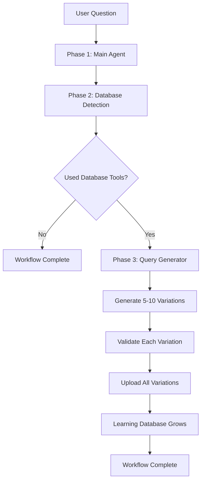

# 🚀 BlitzAgent Workflow & Easy Model Switching

This guide covers the **Workflow functionality** and **Easy Model Switching** features in BlitzAgent.

## 🎯 Quick Start

### Easy Model Switching

**Before**: Complex configuration files and environment variables
**Now**: Just one line of code!

```python
# In any playground file, just change this:
PLAYGROUND_MODEL = "gpt-4o"  # 🔥 That's it!

# Or try:
PLAYGROUND_MODEL = "claude-sonnet-4-20250514" 
PLAYGROUND_MODEL = "gemini-2.5-pro"
PLAYGROUND_MODEL = "azure:gpt-4o"
```

### Workflow Mode

**Before**: Single agent that manually uploads queries
**Now**: Deterministic workflow that automatically generates learning variations!

```python
# Create a workflow instead of a single agent
workflow = await create_blitz_workflow(
    model_override="gpt-4o"  # Easy model switching!
)
```

## 🏗️ Architecture Overview

### Workflow Execution



### Workflow Advantages

✅ **Deterministic**: Pure Python logic controls execution
✅ **Caching**: Built-in session state management  
✅ **Error Handling**: Try/catch around each phase
✅ **Detection**: Automatic database tool detection
✅ **State Management**: Built-in storage and retrieval
✅ **Control**: Full control over when each agent runs

### Model Auto-Detection

```mermaid
graph LR
    A[model("gpt-4o")] --> B{Auto-Detect}
    B --> C[OpenAI Provider]
    B --> D[Claude Provider]
    B --> E[Gemini Provider]
    B --> F[Azure Provider]
    C --> G[Set API Key from ENV]
    D --> G
    E --> G
    F --> G
```

## 📋 Usage Guide

### 1. Easy Model Switching

#### Supported Models

| Model Name | Provider | Auto-detected |
|------------|----------|---------------|
| `gpt-4o` | OpenAI | ✅ |
| `gpt-4o-mini` | OpenAI | ✅ |
| `o1` | OpenAI | ✅ |
| `o1-mini` | OpenAI | ✅ |
| `o3-mini` | OpenAI | ✅ |
| `claude-sonnet-4-20250514` | Anthropic | ✅ |
| `claude-3-5-sonnet` | Anthropic | ✅ |
| `gemini-2.5-pro` | Google | ✅ |
| `gemini-2.0-flash` | Google | ✅ |
| `azure:gpt-4o` | Azure OpenAI | ✅ |

#### Environment Variables Required

```bash
# OpenAI
export OPENAI_API_KEY="your-key"

# Anthropic
export ANTHROPIC_API_KEY="your-key"

# Google
export GEMINI_API_KEY="your-key"
# OR
export GOOGLE_API_KEY="your-key"

# Azure OpenAI
export AZURE_OPENAI_API_KEY="your-key"
export AZURE_OPENAI_ENDPOINT="https://your-resource.openai.azure.com/"
```

#### Examples

```python
# In playground.py
PLAYGROUND_MODEL = "gpt-4o"           # OpenAI GPT-4o
PLAYGROUND_MODEL = "claude-sonnet-4-20250514"  # Claude Sonnet 4
PLAYGROUND_MODEL = "gemini-2.5-pro"   # Gemini 2.5 Pro
PLAYGROUND_MODEL = "azure:gpt-4o"     # Azure OpenAI GPT-4o
```

### 2. Workflow Mode

#### Two Agents in Deterministic Workflow

1. **Main Agent** (`BlitzAgent Main`)
   - Handles user questions
   - Uses database, API, and web scraping
   - Validates and uploads queries

2. **Query Generator Agent** (`BlitzAgent Query Generator`)
   - Automatically triggered after DB queries are detected
   - Generates 5-10 similar variations
   - Validates and uploads each variation
   - Builds learning database

#### Workflow Control Logic

The workflow provides deterministic control:
- **Phase 1**: Main Agent handles all user questions first
- **Phase 2**: Python logic detects database tool usage
- **Phase 3**: Query Generator only called if database queries were used
- **Caching**: Results cached with metadata for performance
- **Error Handling**: Graceful failure and retry logic

### 3. Running the Playground

#### Workflow Mode (Recommended)

```bash
# Run the playground with workflow
python -m blitzagent_agno.playground
# Choose "BlitzAgent Workflow" in the UI
```

#### Testing the Workflow

```bash
# Test the workflow directly
python test_workflow.py
```

## 🔧 Code Examples

### Creating a Workflow Programmatically

```python
from src.blitzagent_agno.agent_factory import (
    create_blitz_workflow,
    RuntimeContext,
    RuntimeMode,
    ToneStyle
)

# Create workflow with specific model
workflow = await create_blitz_workflow(
    model_override="gpt-4o",
    context=RuntimeContext(
        mode=RuntimeMode.CONVERSATION,
        tone=ToneStyle.PROFESSIONAL
    ),
    session_id="my_workflow_session"
)

# Run the workflow
response = workflow.run("What percent of pitchers have sub-2 ERA?")
```

### Creating Individual Agents with Model Override

```python
# Single agent with model override
agent = await create_playground_agent(
    model_override="claude-sonnet-4-20250514"
)

# Query generator agent
query_gen = await create_query_generator_agent(
    model_override="gemini-2.5-pro"
)
```

### Workflow in Playground

```python
# Use in playground
playground = Playground(
    agents=[single_agent],
    workflows=[workflow]
)
```

## 🚀 Workflow Features

### Built-in Caching

```python
# Workflow automatically caches:
# - Main agent responses with metadata
# - Query generator variations
# - Database tool detection results
# - Timestamps and session data

# Cache keys based on user query hash
# Smart cache invalidation
# Session-based storage
```

### Database Tool Detection

```python
# Automatically detects these tools:
database_tools = [
    "blitzAgent_query",
    "blitzAgent_upload", 
    "blitzAgent_validate",
    "blitzAgent_get_database_documentation",
    "blitzAgent_recall_similar_db_queries",
    "blitzAgent_inspect",
    "blitzAgent_sample",
    "blitzAgent_scan"
]
```

### Error Handling

```python
# Workflow handles errors gracefully:
try:
    main_response = await self.main_agent.arun(user_query)
    # Process response...
except Exception as e:
    logger.error(f"Workflow error: {str(e)}")
    yield RunResponse(content=f"Error: {str(e)}", event=RunEvent.run_error)
```

## 📊 Workflow vs Single Agent

| Feature | Single Agent | Workflow |
|---------|-------------|----------|
| Query Generation | Manual | Automatic |
| Execution | Non-deterministic | Deterministic |
| Caching | Basic | Advanced |
| Error Handling | Limited | Comprehensive |
| Database Detection | Manual | Automatic |
| State Management | Basic | Full Control |
| Performance | Good | Optimized |

## 🎯 Best Practices

### When to Use Workflow
- ✅ Production applications
- ✅ Need guaranteed query generation
- ✅ Want caching and performance optimization
- ✅ Need deterministic behavior
- ✅ Want full control over execution

### When to Use Single Agent
- ✅ Simple questions
- ✅ No need for query generation
- ✅ Quick testing
- ✅ Minimal overhead

### Model Selection Tips
- 🚀 **GPT-4o**: Best overall performance
- 💰 **GPT-4o-mini**: Cost-effective option
- 🧠 **Claude Sonnet**: Great for analysis
- ⚡ **Gemini 2.0 Flash**: Fast responses
- 🏢 **Azure**: Enterprise deployments

## 🔧 Troubleshooting

### Common Issues

1. **Workflow not detecting database tools**
   - Check tool call logs
   - Verify MCP server connection
   - Enable debug mode

2. **Query generator not running**
   - Workflow automatically detects database usage
   - Check Phase 2 detection logs
   - Verify tool detection keywords

3. **Model switching not working**
   - Check environment variables
   - Verify API keys
   - Review provider auto-detection

### Debug Mode

```python
# Enable debug logging
workflow = await create_blitz_workflow(
    session_id="debug_session",
    debug_mode=True
)
```

## 📈 Performance Optimization

### Caching Strategy
- Main responses cached by query hash
- Query variations cached separately
- Metadata includes timestamps and usage flags
- Smart cache invalidation based on context

### Model Performance
- Use `gpt-4o-mini` for cost optimization
- Use `gpt-4o` for best quality
- Azure models for enterprise reliability
- Gemini Flash for speed-critical applications

---

**Ready to get started?** Run the playground and choose "BlitzAgent Workflow" for the best experience! 🚀 